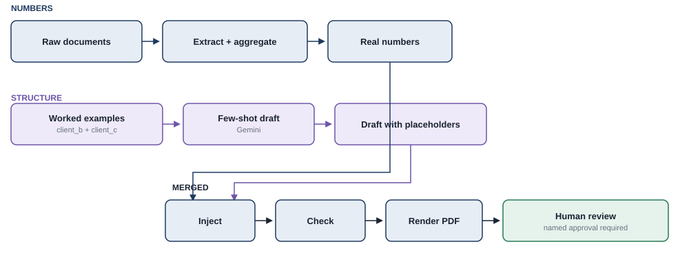

# few-shot-bookkeeper

A bookkeeping assistant that takes a client's raw source documents for a period —
invoices (Rechnung), receipts, etc. — in whatever mix of formats they actually arrive in
(PDF, scans, plain text, ...), and returns a single consolidated PDF: an annual EÜR
(Einnahmen-Überschuss-Rechnung) report. An LLM handles the output PDF's structure —
section layout, style, any diagrams — learned from worked examples, while every number
in it is deterministic and independently verified: the model never writes a digit that
ends up in the final PDF; it only writes placeholders that get filled in and checked by
code afterward.



**Status:** the whole pipeline runs end to end for one fictional client (`client_a`) and
produces a correct, checked PDF. Source docs → extracted fields → aggregated totals →
injected into a draft → independently re-checked → rendered to PDF, and every number
matches the hand-calculated answer key exactly (`python -m src.build_report client_a
<draft.html>`). The few-shot drafter (`src/draft.py`) that's meant to produce that draft
is built and tested (prompt construction, placeholder schema). In the meantime, `tests/
fixtures/client_a_draft_placeholder_only.html` is a hand-authored stand-in draft, used to
prove `inject.py`/`checker.py`/`render.py` work correctly independent of the live model
call. Two further fictional clients (`client_b`, `client_c`) exist as the few-shot worked
examples. A Flask review UI (`src/review_app.py`) is built and tested, including against
a live dev server: a human sees every extracted record, corrects any category the
extractor couldn't confidently classify, previews the checked report, and only gets a
rendered PDF after typing their name.

**Note on evaluating the few-shot drafter specifically:** two worked examples and one
model call is enough to prove the mechanism works, not enough to judge whether the
drafted structure is actually good or reliably generalizes. A real evaluation would need
a larger set of worked examples (more clients, more structural variation) and a stronger
model than the current default — treat any single drafted output today as a pipeline
smoke test, not a quality signal.

Source documents accepted so far: plain text (a stand-in for already-extracted OCR
text) and PDFs — either plain-text PDFs, or ZUGFeRD/Factur-X e-invoices, where the
structured XML embedded in the PDF is parsed directly instead of regexed. Scanned/image
PDFs (needing OCR) are not handled yet.

## Why this design

- **Few-shot, not fine-tuning.** A real client's output PDF has real structure — section
  order, style, diagrams — that a new, unseen set of source documents still needs to be
  rendered into faithfully. The model is shown a couple of worked (source documents →
  output PDF) examples and asked to reproduce that same structure for a new client's
  documents. No training run, no model weights to manage — swapping or adding a worked
  example is a text edit.
- **Numbers are computed and checked, never generated.** A plain deterministic script
  extracts and sums the real figures from the source documents, regardless of their
  original format. The LLM's draft only ever contains placeholders (e.g.
  `{{total_income}}`); a separate injection step substitutes the real numbers, and a
  checker independently re-sums the source documents to confirm every number in the
  output PDF matches before a human ever sees it.

## The worked examples (`client_b`, `client_c`)

The output pattern is grounded in the real structure of a German Anlage EÜR (income
first, expenses by category, then the result), not invented from scratch. Both worked
examples are deliberately harder than `client_a`, and deliberately different from each
other, so the few-shot prompt has to learn an actual *pattern*, not just memorize one
template with different numbers filled in:

- **`client_b`** — a credit note (Gutschrift) that reduces a prior invoice, an invoice
  that states only a gross total (net/VAT back-calculated by hand), a rounding wrinkle
  where net + VAT doesn't reduce to a clean percentage, and a reverse-charge invoice in
  French. Three of its ten docs are flagged in its answer key as cases the current
  text extractor (`src/extract.py`) doesn't handle yet — intentional, not a bug.
- **`client_c`** — a Kleinunternehmer under §19 UStG: no VAT charged on income, and
  because there's no Vorsteuerabzug, expenses are booked at their *gross* amount, not
  net. This forces the output document to genuinely branch (no VAT column on income, a
  single-amount expense table, "USt-Zahllast: entfällt" instead of a number) rather than
  reuse `client_b`'s table shape with different digits. `src/aggregate.py` doesn't know
  about this regime yet (documented as a known gap in `client_c`'s answer key).

Each has a real, WeasyPrint-rendered `expected_output/report.html` (+ a matplotlib
`chart_expenses.png`) that is what the few-shot prompt will show the model as the
target shape — `client_a`'s equivalent output is what the model will eventually draft,
with placeholders instead of these clients' real numbers.

## The drafter (`src/draft.py`)

Builds the few-shot prompt (categories vocabulary + both worked examples' raw docs and
output HTML + the new client's raw docs) and calls Gemini to draft that new client's
report. The exact set of `{{ placeholder.tokens }}` the model is required to use — one
per monetary amount and per date, nothing else — is generated from the same
`extract`/`aggregate` pipeline already verified against `client_a`'s answer key
(`src/placeholders.py`), never invented by the model. Vendor names and invoice/Beleg
identifiers are copied text, not placeholders, since the "never trust the model's
digits" guarantee is specifically about computed/arithmetic figures.

`build_prompt()` is pure and tested without any network call — it asserts every
required placeholder appears in the prompt, and that none of the *computed* totals
(sums that don't appear anywhere in the raw docs themselves) leak into it. Only
`draft()` makes a live call, via `google-genai`, reading `GEMINI_API_KEY` from `.env`,
and retries on a transient `ServerError` (5xx) with backoff.

## Categorization and the `sonstiges` fallback

`extract.py` classifies expenses with a hardcoded German/English keyword list
(`CATEGORY_KEYWORDS`), matched against the vendor/description text. Hardcoding the
*category vocabulary itself* is a deliberate, good choice — a stable, closed list is
what makes consistent tax reporting possible in the first place, and it was fixed on
purpose back when `data/categories.md` was created. Hardcoding the *classification
keywords*, though, is a much weaker bet: real invoices are mostly German, come from
vendors and phrasings nobody enumerated in advance, and a vendor whose text happens not
to contain "büro" or "software" used to make the whole run crash (`ValueError`).

Now it doesn't: an unrecognized vendor falls back to a `sonstiges` (catch-all) category
and the `Record` gets `needs_review=True` — extraction still succeeds, only the category
is uncertain. That flag is exactly what the review UI below surfaces and lets a human
correct before anything is finalized. A further improvement (not built) would be an
LLM-assisted classification fallback for the cases the keyword list misses — reasonable
here specifically because a category name isn't a "digit" the never-trust-the-model rule
is about, and a human still reviews it either way.

## Injection, checking, and rendering (`src/inject.py`, `src/checker.py`, `src/build_report.py`)

Three small, separately-tested steps turn a placeholder-only draft into a verified PDF:

- **`inject.py`** — pure string substitution. Every `{{token.name}}` in the draft becomes
  its real value; an unknown token (the model inventing a name, or a stale draft against
  a changed schema) raises rather than silently leaving it blank.
- **`checker.py`** — re-derives the expected numbers from the raw documents *from
  scratch* (not from whatever value map injection happened to use) and confirms every
  one of them actually appears in the final HTML, with no `{{...}}` left un-substituted.
  This catches both a drafting mistake and a source document that changed after the
  draft was made — tested by literally editing a raw invoice's total after generating
  the "final" HTML and confirming the checker flags it.
- **`build_report.py`** — ties it together: aggregate → inject → check → render. Refuses
  to render a PDF at all if the checker finds anything wrong.

`tests/fixtures/client_a_draft_placeholder_only.html` stands in for a real draft —
hand-authored, following the same pattern as `client_b`'s worked example, so the rest of
the pipeline could be proven end to end independent of any live model call:

```bash
python -m src.build_report client_a tests/fixtures/client_a_draft_placeholder_only.html
# -> outputs/client_a_report.pdf, matching answer_key.md exactly
```

## Human review (`src/review_app.py`)

The last step before anything is final: a small Flask app that puts a named human
between the checked report and `outputs/`.

1. `GET /review/<client_id>` — every extracted record, with a category dropdown for
   expenses (pre-filled; rows with `needs_review=True` are visibly flagged) and income
   shown read-only. A reviewer name field.
2. `POST .../preview` — re-aggregates with any category corrections applied, injects,
   checks, and shows the actual rendered report in an iframe alongside the checker's
   verdict. Approval is disabled if the checker fails.
3. `POST .../approve` — requires a non-empty name, then renders the final PDF (with the
   reviewer's name and an ISO timestamp appended to the report's own footer) and writes
   a separate `outputs/<client_id>_approval.txt` audit record.

```bash
FLASK_APP=src.review_app python -m flask run
# open http://127.0.0.1:5000
```

## Layout

```
data/
  categories.md              # fixed EÜR category vocabulary (incl. "sonstiges" catch-all), shared by aggregator + prompt
  clients/
    client_a/                # test client: source docs + hand-calculated answer key
    client_b/, client_c/     # worked examples for the few-shot prompt:
      raw_docs/               #   source docs (deliberately harder than client_a)
      answer_key.md            #   hand-calculated ground truth + known pipeline gaps
      expected_output/         #   the target output pattern: report.html + chart_expenses.png
src/
  loader.py                  # multi-format ingestion: text/PDF/ZUGFeRD-XML -> plain text or structured XML
  extract.py                 # deterministic field extraction -> Record (vendor, date, category, net/VAT/gross, needs_review)
  aggregate.py               # sums Records into the EÜR totals (income/expenses by category, Überschuss, USt-Zahllast)
  charts.py                  # matplotlib expenses-by-category chart -> PNG
  render.py                  # WeasyPrint: self-contained HTML report -> PDF
  placeholders.py            # the exact {{ token }} schema for every monetary amount/date, derived from Records
  draft.py                   # few-shot prompt (client_b + client_c examples) -> Gemini -> client's draft HTML
  inject.py                  # {{ token }} -> real value, pure substitution
  checker.py                 # independently re-derives expected numbers, flags any mismatch
  build_report.py            # draft -> inject -> check -> render, refuses to render if the check fails
  review_app.py               # Flask: human review + category correction + named approval -> final PDF
run.py                        # CLI: `python run.py <client_id>` prints the EÜR summary
templates/                    # output PDF templates/layouts (not yet built as reusable templates)
tests/                        # unit tests (aggregation math, loader, ZUGFeRD extraction, PDF rendering, drafting,
                               # injection, checking, category fallback, review UI incl. a live-server smoke test)
                               # + fixtures/client_a_draft_placeholder_only.html (stand-in draft)
outputs/                      # generated PDFs, drafts, previews, and approval records (gitignored)
```

## Setup

```bash
# Debian/Ubuntu: venv creation needs this system package first
sudo apt install python3.12-venv

python3 -m venv .venv
source .venv/bin/activate
pip install -r requirements.txt
cp .env.example .env   # fill in GEMINI_API_KEY to run the drafter
```

## Running the pipeline

`data/clients/client_a/answer_key.md` is hand-calculated independently of any code and
is the ground truth the pipeline is checked against:

```bash
python run.py client_a       # prints the EÜR summary; must match answer_key.md
pytest                        # locks in the aggregation math + prompt construction (no network needed)
python -m src.draft client_a  # calls Gemini; needs GEMINI_API_KEY in .env; writes outputs/client_a_draft.html

# full pipeline, using the hand-authored stand-in draft until the live call succeeds:
python -m src.build_report client_a tests/fixtures/client_a_draft_placeholder_only.html
# once draft.py produces a real outputs/client_a_draft.html:
python -m src.build_report client_a outputs/client_a_draft.html
```
